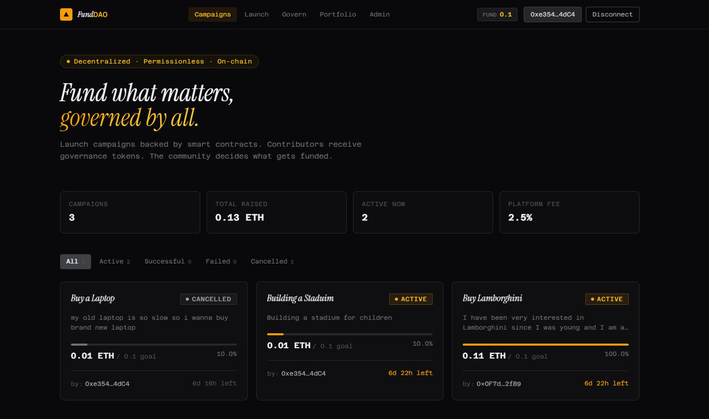
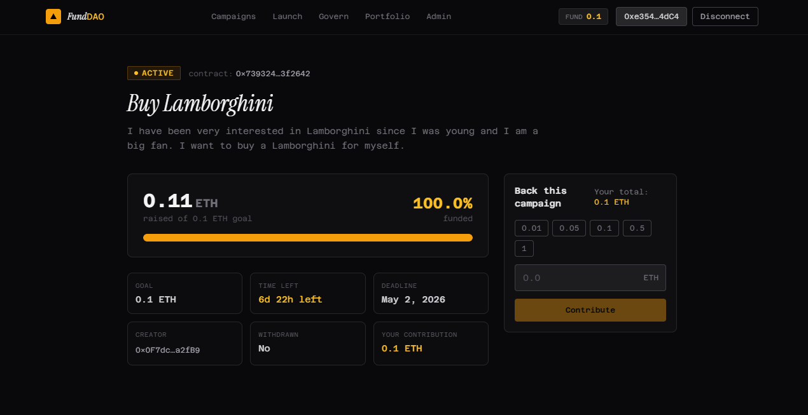
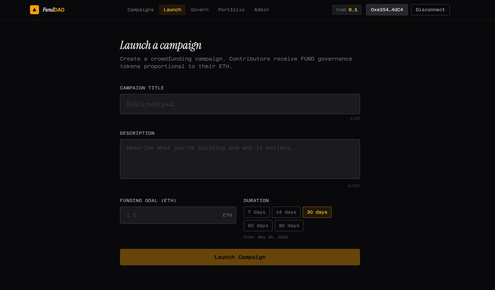
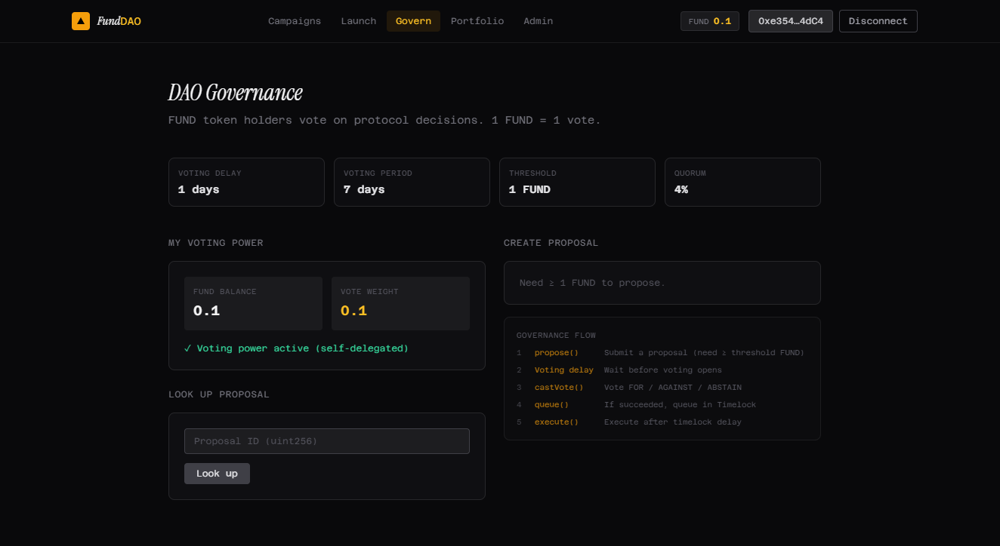
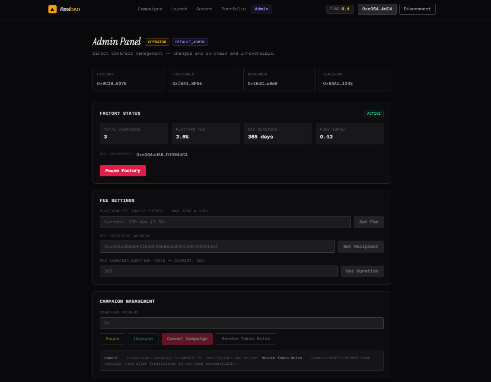
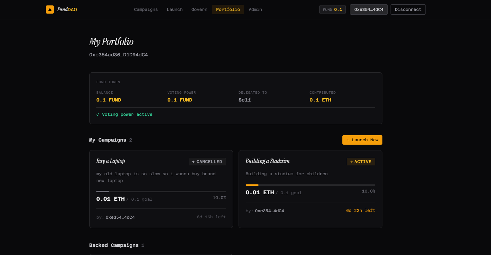
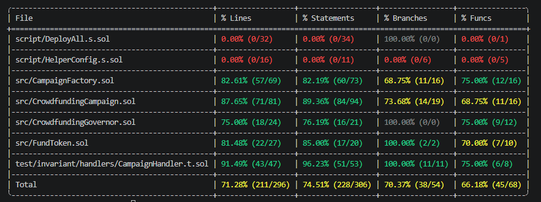

# ⚡ CrowdfundingDAO — Decentralized Crowdfunding with On-Chain Governance

> A production-grade, fully decentralized crowdfunding protocol built on Ethereum Sepolia, powered by **OpenZeppelin Governor** for trustless on-chain governance, **ERC-20 voting tokens** for contributor-proportional voting power, and a **Factory pattern** for per-campaign contract isolation — no trusted intermediary, no admin backdoor.

[](https://croedfundingdaoapp.vercel.app)
[](https://sepolia.etherscan.io/address/0xf8418c6fb5f2b9a5c26409c373d6237862298f5e)
[](https://sepolia.etherscan.io/address/0x9c19ae6ff68c981827a7d6b4a6820f36f0c2637e)
[](https://sepolia.etherscan.io/address/0x16dc32892ce75b2183fa14c7b1a8efd3be75e6e6)
[](https://sepolia.etherscan.io/address/0x9c19ae6ff68c981827a7d6b4a6820f36f0c2637e#code)
[](#testing)
[](https://github.com/GOLIBJON-developer/CrowdFundingDAO/actions/workflows/test.yml)

**Live:** https://crowdfundingdaoapp.vercel.app

---

## Deployed Contracts (Sepolia)

| Contract | Address | Etherscan |
|---|---|---|
| **FundToken** | `0xf8418C6FB5f2B9a5C26409C373d6237862298F5E` | [✅ Verified](https://sepolia.etherscan.io/address/0xf8418c6fb5f2b9a5c26409c373d6237862298f5e) |
| **CampaignFactory** | `0x9C19AE6Ff68C981827A7D6b4a6820f36f0C2637E` | [✅ Verified](https://sepolia.etherscan.io/address/0x9c19ae6ff68c981827a7d6b4a6820f36f0c2637e) |
| **CrowdfundingGovernor** | `0x16dC32892cE75b2183Fa14C7b1a8EFd3be75e6e6` | [✅ Verified](https://sepolia.etherscan.io/address/0x16dc32892ce75b2183fa14c7b1a8efd3be75e6e6) |
| **TimelockController** | `0x63A1D78d4Ac8eAED3675bA41A206dE5377141243` | [✅ Verified](https://sepolia.etherscan.io/address/0x63a1d78d4ac8eaed3675ba41a206de5377141243) |

All 4 contracts verified on Etherscan — every line of logic publicly auditable.

---

## Screenshots

### Main — Campaigns Feed

*Live campaign grid with funding progress, status badges, and filtering by state.*

### Campaign Detail

*Per-campaign page: contribute panel, action panel (finalize / withdraw / refund / cancel), and live funding stats.*

### Launch Campaign

*Create a campaign with goal, duration presets, and on-chain fee preview.*

### Governance

*Propose fee changes or campaign cancellations, cast votes, and look up any proposal by ID.*

### Admin Panel

*Factory controls visible only to wallets with OPERATOR_ROLE or DEFAULT_ADMIN_ROLE.*

### Portfolio

*Personal dashboard: FUND token balance, voting power, created campaigns, and backed campaigns.*

### Test Coverage

*124 tests across unit, fuzz, and invariant suites — all passing.*

---

## Table of Contents

- [What It Does](#what-it-does)
- [Why I Built This](#why-i-built-this)
- [How It Works](#how-it-works)
- [Architecture](#architecture)
- [Smart Contracts](#smart-contracts)
  - [Contract Overview](#contract-overview)
  - [FundToken](#fundtoken)
  - [CrowdfundingCampaign](#crowdfundingcampaign)
  - [CampaignFactory](#campaignfactory)
  - [CrowdfundingGovernor](#crowdfundinggovernor)
  - [Functions Reference](#functions-reference)
  - [Security Design](#security-design)
  - [Gas Optimizations](#gas-optimizations)
- [Frontend](#frontend)
  - [Pages](#pages)
  - [Hook Architecture](#hook-architecture)
- [Testing](#testing)
- [CI / CD](#ci--cd)
- [Local Development](#local-development)
- [Deployment Guide](#deployment-guide)
- [Project Structure](#project-structure)
- [Lessons Learned](#lessons-learned)
- [Tech Stack](#tech-stack)

---

## What It Does

CrowdfundingDAO is a trustless crowdfunding protocol where:

1. Anyone deploys a campaign with a funding goal and deadline via the **Factory**
2. Contributors send ETH and receive **FUND tokens** — 1 token per 1 wei contributed
3. FUND tokens grant **governance voting power** — contributors vote proportionally to their stake
4. After the deadline, any address can call `finalize()` — no trusted party required
5. If the goal is met: creator withdraws (minus platform fee). If not: contributors refund and FUND tokens are burned
6. The **DAO** (FUND token holders) governs the protocol — can change fees, cancel fraudulent campaigns, pause the factory — all via on-chain proposals with a 2-day Timelock delay

There is no trusted server. There is no admin who can unilaterally drain funds. The contracts enforce every rule.

---

## Why I Built This

I built this project for two reasons: to sharpen production-grade Solidity skills beyond simple tutorials, and to build something with genuine architectural complexity that demonstrates what a full-stack Web3 developer can actually deliver.

**The specific problems I wanted to solve:**

**Governance as a first-class feature, not an afterthought.** Most portfolio crowdfunding projects have a simple owner address that controls everything. That is not how production DeFi protocols work. I wanted to build a system where control is progressively handed to token holders — contributors who backed campaigns literally own the protocol's direction.

**Factory pattern for real-world scalability.** Storing all campaigns in a single contract creates unbounded storage, makes state management fragile, and means a single bug can freeze all campaigns. Deploying each campaign as its own contract mirrors how Uniswap, Aave, and MakerDAO handle multi-instance systems.

**Access control with role separation.** Building three distinct roles (DEFAULT_ADMIN, OPERATOR, and campaign-level MINTER/BURNER) taught me how real protocols manage permission layers without creating single points of failure.

**Token economics tied to participation.** FUND tokens minted on contribution and burned on refund mean governance power tracks actual skin-in-the-game — not arbitrary airdrops. This is a deliberate design choice that mirrors how Curve, Balancer, and similar protocols think about vote-locking.

**Circular dependency resolution.** FundToken needs Factory as admin; Factory needs FundToken's address. Solving this with a two-phase initialization pattern (deploy → grant roles → wire) is the kind of real deployment problem that never appears in tutorial projects.

---

## How It Works

```
1. Creator calls factory.createCampaign(goal, deadline, title, description)
         │
         └── Factory deploys a new CrowdfundingCampaign contract
             Factory grants MINTER + BURNER roles to the campaign on FundToken
         │
2. Contributors call campaign.contribute{value: X}()
         │
         └── ETH held in campaign contract
             FundToken.mint(contributor, X) — 1 FUND per 1 wei
         │
3. After deadline, anyone calls campaign.finalize()
         │
         ├── totalRaised >= goal → SUCCESSFUL
         │   └── Factory revokes MINTER + BURNER (no more tokens)
         │
         └── totalRaised < goal → FAILED
             └── Factory revokes MINTER only (BURNER stays for refunds)
         │
4a. SUCCESSFUL → creator calls campaign.withdraw()
         └── Platform fee deducted → sent to feeRecipient
             Remainder → sent to creator

4b. FAILED/CANCELLED → contributors call campaign.refund()
         └── FundToken.burnFrom(contributor, amount) — tokens destroyed
             ETH returned to contributor

5. Governance — FUND holders can propose on-chain changes:
         propose() → vote() → queue() → [2-day Timelock] → execute()
         Examples: setPlatformFee(), cancelCampaign(), pauseFactory()
```

**Campaign state machine — forward-only:**

```
ACTIVE ──(deadline + goal met)──────────► SUCCESSFUL (terminal)
ACTIVE ──(deadline + goal not met)──────► FAILED     (terminal)
ACTIVE ──(creator or DAO cancels)───────► CANCELLED  (terminal)
```

---

## Architecture

```
┌─────────────────────────────────────────────────────────┐
│                   Next.js 14 Frontend                   │
│   Wagmi v2  ·  Viem  ·  TanStack Query                 │
│                                                         │
│  Pages: / · /create · /campaign/[addr] · /governance   │
│          /portfolio · /admin                            │
│                                                         │
│  useFactory    createCampaign, getCampaigns, bulkInfo  │
│  useCampaign   contribute, finalize, withdraw, refund  │
│  useFundToken  balance, votes, delegate                │
│  useGovernance propose, castVote, queue, execute       │
│  useAdmin      pause, setFee, cancelCampaign, roles    │
└───────────────────────┬─────────────────────────────────┘
                        │ JSON-RPC
┌───────────────────────▼─────────────────────────────────┐
│                    CampaignFactory                      │
│  createCampaign()  cancelCampaign()  setPlatformFee()  │
│  onCampaignFinalized()  grantRole()  pauseFactory()    │
│                                                         │
│  deploys ──► CrowdfundingCampaign (one per campaign)   │
│  grants  ──► MINTER + BURNER roles on FundToken        │
└───────┬────────────────────┬────────────────────────────┘
        │                    │
┌───────▼────────┐  ┌────────▼───────────────────────────┐
│   FundToken    │  │      CrowdfundingCampaign           │
│  ERC20Votes    │  │  contribute()  finalize()          │
│  AccessControl │  │  withdraw()    refund()            │
│  mint/burnFrom │  │  cancel()      pause()             │
└───────┬────────┘  └────────────────────────────────────┘
        │ IVotes
┌───────▼────────────────────────────────────────────────┐
│               CrowdfundingGovernor                     │
│  propose()  castVote()  queue()  execute()             │
│               ↓ (2-day delay)                          │
│           TimelockController                           │
│  → controls Factory (setPlatformFee, cancelCampaign…) │
└────────────────────────────────────────────────────────┘
```

---

## Smart Contracts

### Contract Overview

| Contract | Inheritance | Role |
|---|---|---|
| `FundToken` | ERC20, ERC20Votes, ERC20Permit, AccessControl | Governance token — mint on contribute, burn on refund |
| `CrowdfundingCampaign` | ReentrancyGuard, Pausable | Per-campaign state machine, ETH custody |
| `CampaignFactory` | AccessControl, Pausable, ReentrancyGuard | Deploys campaigns, manages platform config |
| `CrowdfundingGovernor` | OZ Governor suite | On-chain voting — controls Factory via Timelock |
| `TimelockController` | OZ TimelockController | 2-day execution delay after proposals pass |

---

### FundToken

`FundToken` is a standard ERC-20 with two critical extensions:

**ERC20Votes** — enables token-weighted governance. Every `transfer`, `mint`, and `burn` updates vote checkpoints. Holders must `delegate()` (or self-delegate) to activate voting power. Snapshots are taken at proposal creation time to prevent flash-loan attacks.

**AccessControl with role separation:**

| Role | Holder | Can Do |
|---|---|---|
| `DEFAULT_ADMIN_ROLE` | CampaignFactory | Grant / revoke campaign roles |
| `MINTER_ROLE` | Each CrowdfundingCampaign | Call `mint()` |
| `BURNER_ROLE` | Each CrowdfundingCampaign | Call `burnFrom()` (no allowance needed) |

`burnFrom()` intentionally bypasses the ERC-20 allowance check — the campaign contract is trusted to burn only what it owes (the contributor's own contribution amount), and requiring the contributor to pre-approve would create a two-step UX that breaks the refund flow.

**OZ v5 multiple-inheritance resolution** — both `ERC20` and `ERC20Votes` define `_update()`, and both `ERC20Permit` and `Nonces` expose `nonces()`. Solidity requires explicit overrides; `super._update()` and `super.nonces()` route through the C3 linearized MRO correctly.

---

### CrowdfundingCampaign

Each campaign is a fully independent contract deployed by the Factory. Key design decisions:

**Immutable storage** — creator, factory, fundToken, goal, deadline, and platformFeeBps are all `immutable`. They are stored in bytecode, not storage, costing 0 gas on every read vs. 2,100 gas (cold SLOAD) for regular storage variables.

**CEI (Checks-Effects-Interactions) pattern** — every function zeros out state before making external calls. In `refund()`, `s_contributions[msg.sender] = 0` executes before `burnFrom()` and the ETH transfer, making reentrancy impossible even without the `nonReentrant` guard (which is also present as a second layer).

**Permissionless finalization** — `finalize()` has no `onlyCreator` guard. After the deadline, any address can trigger it. This prevents a creator from blocking a failed campaign by simply never calling finalize.

**Role revocation on finalization** — when a campaign finalizes as SUCCESSFUL, Factory revokes both MINTER and BURNER roles (no more minting, no refunds needed). When FAILED, only MINTER is revoked — BURNER stays active so contributors can still call `refund()` and burn their tokens.

---

### CampaignFactory

The Factory is the protocol's operational hub. It holds `DEFAULT_ADMIN_ROLE` on FundToken, meaning only the Factory can grant minting rights to new campaigns.

**`createCampaign()` flow:**

```
new CrowdfundingCampaign(creator, address(this), fundToken, goal, deadline, fee, title, desc)
    → s_campaigns.push(campaign)
    → s_isCampaign[campaign] = true
    → s_creatorCampaigns[creator].push(campaign)
    → i_fundToken.grantCampaignRoles(campaign)  // MINTER + BURNER granted
```

**`onCampaignFinalized(bool successful)`** — called by the campaign in `finalize()`. Factory then calls the appropriate revoke function on FundToken. This indirection is necessary because the campaign itself does not hold admin rights on FundToken — only the Factory does.

**Fee snapshot** — `platformFeeBps` is snapshotted at campaign creation time and stored as `i_platformFeeBps` in the campaign's bytecode. Changing the factory fee does not retroactively affect live campaigns — only new ones.

---

### CrowdfundingGovernor

Standard OZ Governor v5 stack:

| Extension | What It Does |
|---|---|
| `GovernorSettings` | Configurable `votingDelay`, `votingPeriod`, `proposalThreshold` |
| `GovernorCountingSimple` | FOR / AGAINST / ABSTAIN vote counting |
| `GovernorVotes` | Vote weight from FundToken (IVotes interface) |
| `GovernorVotesQuorumFraction` | Quorum = 4% of total FUND supply |
| `GovernorTimelockControl` | Routes execution through TimelockController |

**Clock mode: `timestamp`** — The governor uses `block.timestamp` (not `block.number`) for `votingDelay` and `votingPeriod`. This means `1 days` in the constructor means exactly one day of real time. Tests use `vm.warp()` (not `vm.roll()`) to advance time. This is the correct approach for OZ v5 governor contracts.

**Governance parameters:**

| Parameter | Value | Notes |
|---|---|---|
| `votingDelay` | 1 day | Time between proposal and vote start |
| `votingPeriod` | 1 week | Voting window |
| `proposalThreshold` | 1 FUND | Minimum tokens to propose (= 1 wei contributed) |
| `quorumNumerator` | 4% | Of total FUND supply |
| `timelockDelay` | 2 days | Between passed vote and execution |

---

### Functions Reference

#### CrowdfundingCampaign

| Function | Access | Description |
|---|---|---|
| `contribute()` | `payable`, anyone | Send ETH, receive FUND tokens 1:1 |
| `finalize()` | Anyone (after deadline) | Transition to SUCCESSFUL or FAILED |
| `withdraw()` | Creator only | Withdraw ETH after success (minus platform fee) |
| `refund()` | Contributors only | Reclaim ETH after failure/cancel; burns FUND tokens |
| `cancel()` | Creator or Factory | Cancel active campaign; enable refunds |
| `pause()` / `unpause()` | Factory only | Emergency stop on contributions |
| `getCampaignInfo()` | View | All campaign fields in one call |
| `fundingProgress()` | View | 0–100 percentage funded |
| `timeRemaining()` | View | Seconds until deadline (0 if past) |
| `isAcceptingContributions()` | View | Active + not paused + before deadline |

#### CampaignFactory

| Function | Access | Description |
|---|---|---|
| `createCampaign()` | Anyone | Deploy new campaign, grant token roles |
| `onCampaignFinalized(bool)` | Campaigns only | Revoke appropriate token roles |
| `cancelCampaign()` | OPERATOR_ROLE | Cancel a campaign (fraud, violations) |
| `pauseCampaign()` / `unpauseCampaign()` | OPERATOR_ROLE | Emergency stop |
| `pauseFactory()` / `unpauseFactory()` | OPERATOR_ROLE | Block new campaign creation |
| `setPlatformFee()` | DEFAULT_ADMIN | Affects future campaigns only |
| `setFeeRecipient()` | DEFAULT_ADMIN | Update fee destination |
| `setMaxDuration()` | DEFAULT_ADMIN | Cap on campaign duration |
| `getCampaignsPaginated()` | View | Paginated list for frontends |
| `getCampaignsByCreator()` | View | Campaigns by creator address |

#### CrowdfundingGovernor

| Function | Access | Description |
|---|---|---|
| `propose()` | ≥ proposalThreshold FUND | Submit proposal |
| `castVote()` | FUND holders | Vote FOR (1) / AGAINST (0) / ABSTAIN (2) |
| `castVoteWithReason()` | FUND holders | Vote with on-chain reason string |
| `queue()` | Anyone (after Succeeded) | Send to Timelock |
| `execute()` | Anyone (after Timelock delay) | Run the on-chain action |
| `cancel()` | Proposer or guardian | Cancel before execution |

---

### Security Design

| Concern | Mitigation |
|---|---|
| Reentrancy | CEI pattern + `nonReentrant` on all ETH-transferring functions |
| Double refund / withdraw | Storage zeroed before external call; `s_withdrawn` flag |
| Token inflation | Only `MINTER_ROLE` holders (campaigns) can mint |
| Unauthorized burn | `burnFrom()` requires `BURNER_ROLE`; bypasses allowance intentionally |
| Mid-round admin changes | Platform fee snapshotted at creation; creator can't change goal/deadline |
| Governance attack | Snapshot voting power at proposal creation; 2-day Timelock delay |
| Creator rug-pull | Creator cannot touch ETH until `finalize()` confirms success |
| Fee recipient manipulation | Fee recipient read from Factory at withdrawal time — updateable only by admin |
| Private key exposure | `cast wallet` encrypted keystore; no raw keys in files or environment |
| Circular dependency | Two-phase init: deploy → grant → wire; `cfg.admin` passed explicitly |

---

### Gas Optimizations

**Immutable variables** — all constructor parameters in `CrowdfundingCampaign` are `immutable`. Each read costs 0 gas (bytecode) vs. 2,100 gas (cold SLOAD). With 6 immutable fields (creator, factory, fundToken, goal, deadline, platformFeeBps), every function that reads them saves up to 12,600 gas on cold access.

**`uint48` for deadline** — OZ v5 pattern. Fits in a slot alongside other small values, reducing storage slot count.

**`unchecked` increments in loops** — `getCampaignsPaginated()` uses `unchecked { ++i }` since the loop bound guarantees no overflow.

**Single `getCampaignInfo()` getter** — returns all 8 campaign fields in one call. The frontend uses this instead of 8 separate RPC calls, reducing latency and RPC costs.

**`useReadContracts` batching** — the frontend batches all read calls into a single JSON-RPC request via Wagmi's `useReadContracts`, minimizing round trips.

---

## Frontend

**Live:** [https://crowdfundingdaoapp.vercel.app](https://croedfundingdaoapp.vercel.app)

Built with Next.js 14 (App Router), Wagmi v2, and Viem.

### Pages

| Route | Description |
|---|---|
| `/` | Campaign grid — filter by state, live funding stats |
| `/create` | Deploy a campaign — goal, duration, title, description |
| `/campaign/[address]` | Detail page — contribute, finalize, withdraw, refund, cancel |
| `/governance` | Propose, vote, look up proposals by ID |
| `/portfolio` | My campaigns, backed campaigns, FUND balance, voting power |
| `/admin` | Factory management — visible only to OPERATOR/ADMIN wallets |

### Hook Architecture

| Hook | Reads | Writes |
|---|---|---|
| `useFactory` | getCampaigns, bulk campaign info, stats | createCampaign |
| `useCampaign` | getCampaignInfo, paused(), stats, contribution | contribute, finalize, withdraw, refund, cancel |
| `useFundToken` | balance, votes, delegates, totalSupply | delegate |
| `useGovernance` | proposalState, proposalVotes, hasVoted, settings | propose, castVote, queue, execute |
| `useAdmin` | hasRole, factory overview | pauseFactory, setFee, cancelCampaign, grantRole |

**Auto-refetch on write** — every write hook calls `useQueryClient().invalidateQueries()` on transaction confirmation. All reads across all hooks refresh simultaneously — no stale state after any on-chain action.

**Paused state propagation** — `useCampaignStats` reads `paused()` separately from `s_state`. The `StatusBadge` component accepts a `isPaused` prop and renders an orange `PAUSED` badge that overrides the normal state badge. The `ContributePanel` shows a warning and disables the form.

**Admin gate** — the admin page checks `hasRole(OPERATOR_ROLE, address)` and `hasRole(DEFAULT_ADMIN_ROLE, address)` on-chain. No hardcoded address. The Navbar only shows the "Admin" link to wallets with either role.

---

## Testing

```
Total:            124 tests
Unit:              96 tests
Fuzz:              18 tests (1,000 runs each)
Invariant:          7 invariants (256 runs, depth 128)
Fuzz seed:        0x1
Result:           All passing
```

### Coverage by Contract

| Contract | Tests | What Is Verified |
|---|---|---|
| `FundToken` | 24 | Constructor, mint, burnFrom, grantCampaignRoles, revokeMinterRole, votes, delegation, fuzz |
| `CrowdfundingCampaign` | 47 | All state transitions, contribute, finalize, withdraw, refund, cancel, pause, view functions, fuzz |
| `CampaignFactory` | 25 | createCampaign, fee management, role management, pause, pagination, fuzz |
| `CrowdfundingGovernor` | 14 | Constructor params, propose, full governance cycle, castVote, defeated proposals, quorum |
| **Invariants** | 7 | ETH solvency, token supply conservation, state forward-only, ETH conservation, token balance bounds, terminal state finality |

### Invariants

| Invariant | What It Proves |
|---|---|
| `invariant_CampaignIsAlwaysSolvent` | `campaign.balance == contributions - refunds` at all times |
| `invariant_TokenSupplyMatchesNetContributions` | `totalSupply == tokensMinted - tokensBurned` |
| `invariant_EthConservation` | No ETH is ever created or destroyed |
| `invariant_TokenBalanceNeverExceedsContribution` | Tokens can never exceed original contribution |
| `invariant_StateIsAlwaysValid` | State is always a valid enum value (0–3) |
| `invariant_ZeroContributionZeroTokens` | Non-contributors always have 0 tokens |
| `invariant_TerminalStatesAreFinal` | SUCCESSFUL/FAILED states never revert to ACTIVE |

### Running Tests

```bash
# All tests
forge test -v

# Unit tests
forge test --match-path "test/unit/*" -vvv

# Fuzz tests only
forge test --match-test "testFuzz" -vvv

# Invariant tests
forge test --match-path "test/invariant/*" -vvv

# Gas report
forge test --gas-report

# Coverage
forge coverage --report lcov
```

---

## CI / CD

GitHub Actions runs automatically on every push and pull request:

```yaml
- uses: actions/checkout@v4
  with:
    submodules: recursive          # forge-std + openzeppelin pulled as git submodules
- uses: foundry-rs/foundry-toolchain@v1
- forge fmt --check                # fails if any file is not correctly formatted
- forge build --sizes              # contract sizes visible in CI log
- forge test -vvv                  # all 124 tests must pass
- forge snapshot --check           # gas regression check (tolerance 10%)
```

The CI badge at the top of this README reflects the latest run status.

---

## Local Development

### Prerequisites

- [Node.js 20+](https://nodejs.org)
- [Foundry](https://book.getfoundry.sh/getting-started/installation)
- Sepolia ETH from [faucets.chain.link](https://faucets.chain.link) or [sepoliafaucet.com](https://sepoliafaucet.com)

### Setup

```bash
git clone https://github.com/GOLIBJON-developer/CrowdFundingDAO
cd CrowdFundingDAO

# Smart contract dependencies (git submodules)
git submodule update --init --recursive

# Frontend dependencies
cd frontend
npm install
```

### Run locally

```bash
# Terminal 1 — local chain
make anvil

# Terminal 2 — deploy to Anvil (imports default Anvil key automatically)
make wallet-setup-anvil   # one-time: imports Anvil default key as 'anvil0'
make deploy-local

# Terminal 3 — frontend
cd frontend
cp .env.local.example .env.local
# Set NEXT_PUBLIC_FACTORY_ADDRESS etc. from deploy output
npm run dev
# Open http://localhost:3000
```

---

## Deployment Guide

### Environment Variables

Create `.env` in the project root:

```env
# Sepolia RPC (Alchemy or public)
SEPOLIA_RPC_URL=https://eth-sepolia.g.alchemy.com/v2/YOUR_KEY

# Block explorer
ETHERSCAN_API_KEY=YOUR_KEY

# Admin wallet (receives DEFAULT_ADMIN_ROLE)
ADMIN_ADDRESS=0xYOUR_WALLET_ADDRESS
FEE_RECIPIENT_ADDRESS=0xYOUR_WALLET_ADDRESS
```

### Import wallet (one time)

```bash
# Import your key as an encrypted keystore — no raw keys in .env
cast wallet import mykey --interactive

# List wallets
cast wallet list
```

### Deploy to Sepolia

```bash
make deploy-sepolia
```

This deploys all 5 contracts in the correct order, wires all roles and access control, and verifies source code on Etherscan automatically.

**Deployment order (solves circular dependency):**

```
1. Deploy FundToken(cfg.admin)            → admin gets DEFAULT_ADMIN_ROLE
2. Deploy TimelockController(cfg.admin)   → admin is temporary timelock admin
3. Deploy CampaignFactory(fundToken, ...)
4. FundToken.grantRole(DEFAULT_ADMIN, factory) → factory can grant campaign roles
5. Deploy CrowdfundingGovernor(fundToken, timelock)
6. Timelock: grant PROPOSER + EXECUTOR to Governor
7. Factory: grant DEFAULT_ADMIN + OPERATOR to Timelock
8. (Optional) Renounce deployer roles → fully decentralized
```

### Update frontend

After deployment, copy addresses from the deploy output into `frontend/.env.local`:

```env
NEXT_PUBLIC_CHAIN_ID=11155111
NEXT_PUBLIC_FACTORY_ADDRESS=0x...
NEXT_PUBLIC_FUND_TOKEN_ADDRESS=0x...
NEXT_PUBLIC_GOVERNOR_ADDRESS=0x...
NEXT_PUBLIC_TIMELOCK_ADDRESS=0x...
NEXT_PUBLIC_RPC_URL=https://rpc.sepolia.org
```

### Frontend Deployment (Vercel)

```bash
cd frontend
npx vercel --prod
```

Or connect the repo at [vercel.com/new](https://vercel.com/new) and set the root directory to `frontend`.

---

## Project Structure

```
CrowdFundingDAO/
│
├── src/
│   ├── interfaces/
│   │   └── IFundToken.sol             Interface for FundToken
│   ├── FundToken.sol                  ERC20Votes + AccessControl governance token
│   ├── CrowdfundingCampaign.sol       Per-campaign contract (state machine, ETH custody)
│   ├── CampaignFactory.sol            Factory — deploys campaigns, manages platform config
│   └── CrowdfundingGovernor.sol       OZ Governor + Timelock — on-chain DAO
│
├── script/
│   ├── HelperConfig.s.sol             Network config (Anvil / Sepolia / Mainnet)
│   └── DeployAll.s.sol                One-shot deployment with role wiring
│
├── test/
│   ├── unit/
│   │   ├── FundTokenTest.t.sol        24 unit + fuzz tests
│   │   ├── CrowdfundingCampaignTest   47 unit + fuzz tests
│   │   ├── CampaignFactoryTest.t.sol  25 unit + fuzz tests
│   │   └── CrowdfundingGovernorTest   14 governance lifecycle tests
│   └── invariant/
│       ├── Invariants.t.sol           7 invariant properties
│       └── handlers/
│           └── CampaignHandler.t.sol  Fuzzer handler with ghost variables
│
├── frontend/                          Next.js 14 frontend
│   └── src/
│       ├── abi/                       Contract ABIs (JSON)
│       ├── app/
│       │   ├── page.tsx               / — Campaigns feed
│       │   ├── create/page.tsx        /create — Launch campaign
│       │   ├── campaign/[address]/    /campaign/:addr — Detail page
│       │   ├── governance/page.tsx    /governance — DAO voting
│       │   ├── portfolio/page.tsx     /portfolio — Personal dashboard
│       │   └── admin/page.tsx         /admin — Factory management
│       ├── components/
│       │   ├── ui/                    StatusBadge, ProgressBar, AddressChip, TxFeedback, ConnectButton
│       │   ├── layout/                Navbar
│       │   └── campaign/              CampaignCard, ContributePanel, ActionPanel
│       ├── hooks/
│       │   ├── useFactory.ts
│       │   ├── useCampaign.ts
│       │   ├── useFundToken.ts
│       │   ├── useGovernance.ts
│       │   └── useAdmin.ts
│       └── lib/
│           ├── constants.ts           Addresses, chain IDs, state maps
│           ├── utils.ts               Formatters, helpers, CampaignInfo type
│           └── wagmi-config.ts        Wagmi config with injected connector
│
├── img/                               Screenshots for README
│   ├── main-ui.png
│   ├── campaign[address].png
│   ├── launch.png
│   ├── governance.png
│   ├── admin.png
│   ├── portfolio.png
│   └── coverage.png
│
├── .github/
│   └── workflows/
│       └── test.yml                   CI: fmt + build + test + snapshot
│
├── foundry.toml                       Solc, optimizer, fuzz/invariant config
├── Makefile                           deploy-local, deploy-sepolia, test, wallet-setup
└── README.md
```

---

## Lessons Learned

**Circular deployment dependencies require deliberate sequencing**

FundToken needs the Factory's address to set it as `DEFAULT_ADMIN_ROLE`. The Factory needs FundToken's address as a constructor parameter. There is no single deploy order that satisfies both. The solution is two-phase initialization: deploy both with a temporary admin (`cfg.admin`), then wire the roles in subsequent transactions. Every production protocol that has interdependent contracts solves this same problem.

**`msg.sender` inside `vm.startBroadcast()` is not the cast wallet**

Foundry uses a `DefaultSender` address for script simulation. When `vm.startBroadcast()` is called without arguments, `msg.sender` resolves to `DefaultSender` (0x1804...), not the `--account` wallet. Passing `msg.sender` as the admin in constructors creates an admin role on an address you don't control. The fix: always pass `cfg.admin` explicitly.

**OZ Governor `clock()` must match the token's clock mode**

OZ v5 Governor and ERC20Votes both have `clock()` functions that default to `block.number`. If `votingDelay = 1 days`, this means 86,400 blocks — not 1 day. Tests using `vm.warp(+1 day)` advance the timestamp but not the block number, so proposals stay `Pending` forever. The fix: override `clock()` to return `block.timestamp` and `CLOCK_MODE()` to return `"mode=timestamp"` in both `FundToken` and `CrowdfundingGovernor`.

**Finalization must not revoke BURNER role on FAILED campaigns**

The initial design called `revokeCampaignRoles()` in `finalize()` unconditionally — this removes both MINTER and BURNER. But FAILED campaigns still need BURNER rights so contributors can call `refund()` which internally calls `burnFrom()`. The fix: separate `revokeMinterRole()` (for FAILED) from `revokeCampaignRoles()` (for SUCCESSFUL). A seemingly minor distinction that breaks all refunds if missed.

**Solidity public struct getters return tuples, not structs**

`public NetworkConfig activeNetworkConfig` generates a getter that returns 4 separate values as a tuple. Calling it from another contract with `NetworkConfig memory cfg = helperConfig.activeNetworkConfig()` fails with "Different number of components". The fix: mark the field `internal` and write an explicit `getActiveNetworkConfig()` function that returns `NetworkConfig memory`.

**Role management across contract boundaries requires careful planning**

The Factory holds `DEFAULT_ADMIN_ROLE` on FundToken so it can grant `MINTER` and `BURNER` to each campaign. But this means the Factory is also a potential attack surface — if Factory is compromised, token roles can be manipulated. The Timelock as Factory admin provides the 2-day delay buffer. Planning these role boundaries before writing any code would have saved significant redesign time.

**JSON ABI imports need `as Abi` cast in Wagmi v2**

TypeScript infers JSON imports as generic object types. Wagmi v2 expects `Abi` (from viem) — a strictly typed array of ABI entries where `type` must be the literal `"function"` not the string type. Without `as Abi`, the TypeScript compiler rejects every hook that uses ABI imports. A one-line fix, but it affects every contract interaction in the frontend.

---

## Tech Stack

| Layer | Technology | Version |
|---|---|---|
| Smart Contract | Solidity | 0.8.27 |
| Dev Framework | Foundry (forge, cast, anvil) | nightly |
| Governance | OpenZeppelin Governor v5 | 5.x |
| Token Standard | OpenZeppelin ERC20Votes | 5.x |
| Access Control | OpenZeppelin AccessControl | 5.x |
| Reentrancy Protection | OpenZeppelin ReentrancyGuard | 5.x |
| Timelock | OpenZeppelin TimelockController | 5.x |
| Frontend | Next.js | 14.2.15 |
| Language | TypeScript | 5 |
| Ethereum Hooks | Wagmi | v2 |
| Ethereum Library | Viem | v2 |
| Server State | TanStack Query | v5 |
| Styling | Tailwind CSS | 3.x |
| Hosting | Vercel | — |
| CI | GitHub Actions | — |
| Key Management | cast wallet (encrypted keystore) | — |

---

## License

MIT © 2025

---

*Built to demonstrate production-grade Solidity development, multi-contract system architecture, OpenZeppelin Governor integration, security-first design patterns, comprehensive Foundry testing with invariants, and modern Web3 frontend development with Wagmi v2.*